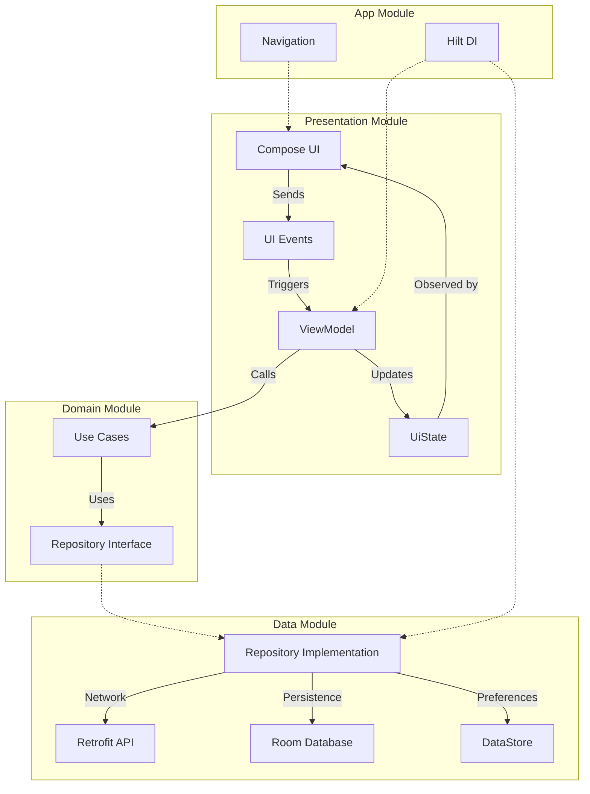

# Recipeo

Recipeo is a professional Android recipe application built with **Kotlin** and **Jetpack Compose**. The app allows users to browse, search, view, and save recipes while providing a reliable **offline-first experience** using Room Database.

The project follows **Clean Architecture** and **MVI (Model-View-Intent)** to keep the codebase organized, maintainable, and easy to scale. One of the main goals of the project is to ensure that users have a seamless experience even in low-connectivity environments, such as a kitchen.

## 1. Project Overview

Recipeo provides a complete user journey from authentication to recipe discovery:

*   **Splash**: Checks for persistent user sessions using DataStore.
*   **Authentication**: Secure entry point for new and returning users.
*   **Home / Recipes**: A central dashboard to explore meals by category.
*   **Search**: Fast, debounced searching for specific recipes.
*   **Meal Details**: Rich content including instructions and YouTube integration.
*   **Favorites**: A personalized collection of saved recipes available anytime.

## 2. Features

### Authentication
*   **Sign In & Sign Up**: Secure authentication flow.
*   **Validation**: Real-time validation for email, phone (using Regex), and password (min length and numeric requirements).
*   **Persistent Session**: Persistent login state managed via Jetpack DataStore.

### Recipe Browsing & Search
*   **Dynamic Categories**: Browse recipes by categories like Seafood, Beef, or Dessert.
*   **Real-time Search**: Debounced search to optimize network usage and avoid unnecessary API calls.
*   **Offline Fallback**: Search and categories remain functional offline using the local cache.

### Recipe Details & Favorites
*   **Complete Instructions**: Full preparation steps and origin metadata.
*   **Media Integration**: Direct links to YouTube cooking tutorials when available.
*   **Local Favorites**: Save recipes locally; favorites are linked with full cached details for complete offline access.

### Offline-First & Error Handling
*   **Connectivity Awareness**: Real-time detection of network state.
*   **Smart Caching**: API responses are automatically merged into the local database.
*   **AppError System**: A domain-level error handling system for timeouts, server errors, and missing cache.

## 3. Tech Stack

| Technology | Purpose |
| --- | --- |
| **Kotlin** | Primary programming language |
| **Jetpack Compose** | Declarative UI framework |
| **MVI** | Unidirectional State Management |
| **Clean Architecture** | Separation of concerns |
| **Retrofit** | Type-safe REST API client |
| **OkHttp** | Networking layer with logging interceptors |
| **Room** | Local SQLite database for persistence |
| **Hilt** | Dependency Injection |
| **Coroutines & Flow** | Asynchronous and reactive data streams |
| **DataStore** | Persistent storage for user session state |
| **Navigation Compose** | Typed and declarative navigation |
| **TheMealDB API** | External recipe data source |

## 4. Architecture

Recipeo is divided into four main modules following Clean Architecture principles:

### `:presentation`
Handles everything related to the UI. It contains **Compose Screens**, **ViewModels**, **UiStates**, and **Events**. The presentation layer communicates with the domain layer through Use Cases and observes state changes via `StateFlow`.

### `:domain`
Contains the core business logic. It defines **Domain Models**, **Repository Interfaces**, and **Use Cases**. This module is a pure Kotlin module, independent of Android framework implementations like Retrofit or Room, following the **Dependency Inversion Principle**.

### `:data`
Responsible for data retrieval and persistence. It contains **Repository Implementations**, **API services**, **Room Database/DAOs**, **DataStore**, and **Mappers**. It handles the logic for choosing between remote and local data sources.

### `:app`
The entry point of the application. It manages **Hilt initialization**, the **MainActivity**, and the global **Navigation** setup.

**Dependency Flow**:
`UI → ViewModel → UseCase → Repository Interface (Domain) ← Repository Implementation (Data) → Remote/Local`

## 5. Architecture Diagram



## 6. MVI Flow

Recipeo uses **MVI** to provide a predictable, unidirectional data flow:

1.  **User Action**: The user interacts with the UI (e.g., searches for "Pasta").
2.  **Event**: The UI sends an `Event` (e.g., `SearchQueryChanged`) to the ViewModel.
3.  **ViewModel**: Receives the event, applies logic (like debouncing), and calls the appropriate **UseCase**.
4.  **Repository**: The UseCase triggers the Repository, which fetches data from the API or Room.
5.  **UiState**: The ViewModel updates a single `StateFlow<UiState>`.
6.  **UI**: The Compose screen observes the `UiState` and automatically recomposes.

## 7. Offline-First & Caching

Offline support is a core pillar of Recipeo, implemented via a centralized fallback strategy.

*   **Online Mode**: When a connection is detected, the app fetches fresh data from **TheMealDB API**, saves it to **Room**, and updates the UI.
*   **Offline Mode**: If the device is offline, the Repository immediately falls back to the **Room** cache.
*   **API Failure**: If an API request fails (timeout or server error), the app attempts to load previously cached data. If no cache exists, a `NoCacheAvailable` error is displayed.
*   **Data Integrity (`mergeWithCache`)**: TheMealDB list APIs often return partial data. The `mergeWithCache()` function ensures that when new list data is fetched, existing rich details (like full instructions) in Room are not overwritten by incomplete API data.
*   **Cached Timing**: The `cachedAt` timestamp is used to maintain the order of cached recipes, ensuring recently viewed meals appear first.

## 8. Room Database

*   **`CachedMealEntity`**: Stores full recipe information for offline browsing, including instructions and YouTube links.
*   **`FavoriteMealEntity`**: Tracks recipes selected by the user.
*   **`FavoriteMealWithCached`**: A Room relationship that joins Favorites with their corresponding Cached details. This allows the Favorites screen to show complete information without duplicating data in the database.

## 9. Authentication

*   **Session Management**: Uses **Jetpack DataStore** to persist the `is_logged_in` flag.
*   **Splash Logic**: Upon launch, the `SplashViewModel` reads the DataStore state to decide whether to navigate to the `Home` screen or the `Login` screen.
*   **Data Persistence**: The login state remains valid even after app restarts or device reboots.

## 10. Navigation

The app uses **Navigation Compose** with the following routes:
*   `splash`: Session check and branding.
*   `login` / `signup`: Authentication screens.
*   `home`: Main dashboard and category browser.
*   `favorites`: Saved recipes list.
*   `details/{mealId}`: Recipe details (passes the `mealId` argument for specific data fetching).

## 11. Project Structure

```text
Recipeo/
├── app/
│   └── src/main/java/com/linkdevelopment/recipeo/
│       ├── MainActivity.kt
│       └── RecipeoApplication.kt
├── domain/
│   └── src/main/java/com/linkdevelopment/domain/
│       ├── model/       # Meal, AppError
│       ├── repository/  # Repository Interfaces
│       ├── usecase/     # Business logic units
│       └── util/        # ICheckNetworkState
├── data/
│   └── src/main/java/com/linkdevelopment/data/
│       ├── remote/      # API Service, DTOs
│       ├── local/       # Room DB, DAOs, Entities, DataSources
│       ├── mapper/      # Data conversion logic
│       ├── repository/  # Repository Implementations
│       └── util/        # CheckNetworkState (Android impl)
└── presentation/
    └── src/main/java/com/linkdevelopment/presentation/
        ├── signup/ / login/ / splash/
        ├── recipes_list/ / details/ / favorites/
        ├── navigation/  # AppNavigation.kt
        ├── components/  # Reusable UI elements
        └── util/        # AuthValidator
```
